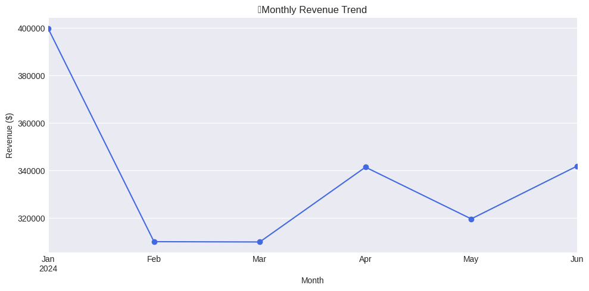
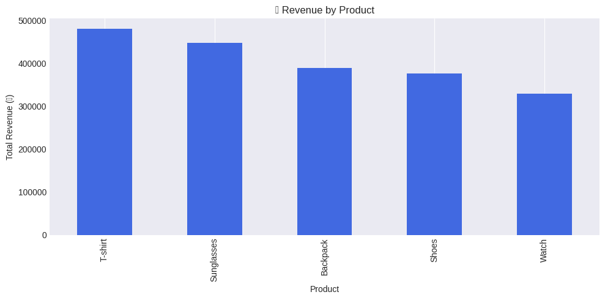

# 📊 Sales Dashboard Project

> 🎯 Milestone 7 from my data science journey — a complete pandas-based analysis and visualization of e-commerce sales.

---

## 🔍 Insights Uncovered

- 📆 Monthly sales trends for revenue and quantity sold
- 🏆 Top-selling products by total revenue
- 💰 Most profitable categories
- 📈 Clean visualizations using matplotlib (line and bar charts)

---

## 📂 Dataset Overview

| Column     | Description                     |
|------------|---------------------------------|
| `date`     | Date of the sale                |
| `product`  | Item sold (e.g. Shoes, T-shirt) |
| `category` | Product category (Apparel, etc.)|
| `quantity` | Units sold                      |
| `price`    | Price per unit                  |
| `revenue`  | Total revenue (quantity × price)|

---

## 🛠 Tools & Libraries Used

- `pandas` – for data manipulation and grouping
- `matplotlib.pyplot` – for charts and plots
- `.resample("M")` – to group sales by month
- `.groupby()` – for product/category summaries

---

## 📈 Visuals

_(Charts saved from notebook as PNG images)_

**Monthly Revenue Trend**

**Revenue by Product**

---

## ✅ Project Status: Complete

This project simulates real-world dashboard analysis using time-series data. It's a key part of my transition from operations to full-time data analytics.

---

## 📓 View the Notebook

📂 [Sales_Dashboard_Project.ipynb](./Sales_Dashboard_Project.ipynb)

---

### 🙌 Let's Connect

Feel free to explore, suggest improvements, or fork the repo.  
I’m open to collaboration and learning every day!

